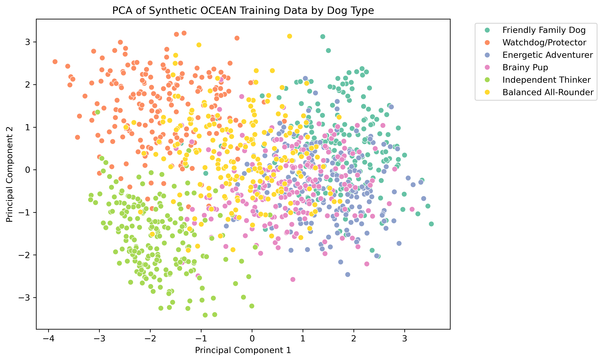
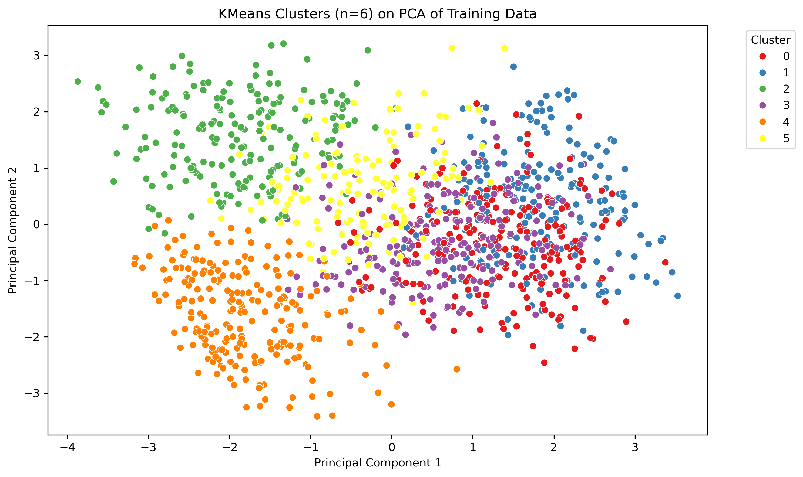
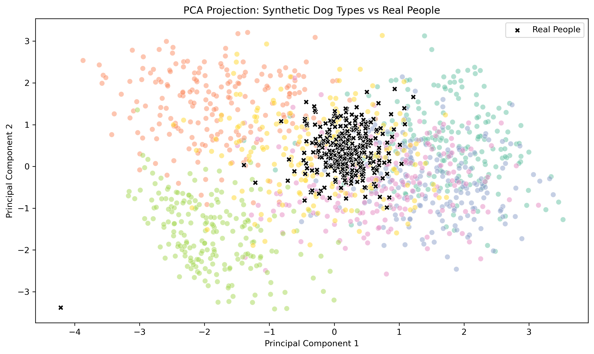

# 🐾 What Kind of Dog Are You?
**Predicting Dog Types and Matching Breeds Based on Human Personality Traits**

---

## 📌 Overview

This project applies machine learning to match people with dog types based on their Big Five personality traits (OCEAN: Openness, Conscientiousness, Extraversion, Agreeableness, Neuroticism). By comparing human OCEAN scores to synthetic dog personality profiles, the model predicts a “dog personality type” and recommends matching AKC breeds.

This project was completed individually as part of the Columbia Engineering Data Analytics Bootcamp.

---

## 🧠 Key Features

- Predicts which dog personality type a user aligns with based on their personality traits
- Suggests AKC breeds that match the predicted dog type
- Uses synthetic training data and real personality data from 1M+ respondents
- Trains and evaluates three models; selects Logistic Regression for final use (accuracy: **80.83%**)
- Stores and retrieves data via SQLite
- Visualizes clustering using PCA and KMeans
- Provides live user input functionality in the notebook

---

## 📁 Data Sources

- **Big Five Personality Test Responses**
  Source: [OpenPsychometrics Raw Data](https://openpsychometrics.org/_rawdata/)

- **AKC Dog Trait Data**
  Source: [Kaggle - Dog Breed Traits](https://www.kaggle.com/datasets)

---

## 🧪 Technologies Used

- Python (Pandas, NumPy, Scikit-learn)
- SQLite (via `sqlite3`)
- Seaborn, Matplotlib
- Jupyter Notebook

---

## 📊 Visualizations

### PCA of Dog Personality Clusters

### KMeans Clustering Overlay

### Real Users Overlaid on PCA

---

## 🔬 Methodology

1. **Data Cleaning & Labeling**
   - Cleaned AKC dog breed traits and labeled each with one of 6 custom dog types
   - Mapped each dog type to a 5D OCEAN profile

2. **Synthetic Training Data**
   - Created 200 synthetic OCEAN samples per dog type
   - Introduced Gaussian noise to simulate personality variation

3. **Model Training**
   - Trained KNN, Logistic Regression, and Random Forest models
   - Evaluated using 80/20 validation split
   - Selected **Logistic Regression** as final model (accuracy: **80.83%**)

4. **Visualization**
   - Used PCA to project OCEAN data into 2D space
   - Compared labeled clusters to KMeans
   - Overlaid real user responses to validate cluster relevance

5. **User Input & Prediction**
   - Built a live prediction function to accept custom OCEAN scores
   - Returned a matching dog personality type and 3 AKC breed suggestions

---

## 🐶 Example Output

🎯 Your dog personality type is: Brainy Pup

🐶 Based on your personality, you're most like one of these dog breeds:
• Poodle
• Shetland Sheepdog
• Papillon

---

## 📈 PCA Interpretation

- **PC1** (X-axis): Sociability & Warmth
  Influenced by high Extraversion and Agreeableness
- **PC2** (Y-axis): Emotional Intensity vs. Creativity
  Contrasts high Neuroticism + Conscientiousness with low Openness

Most real people clustered around Balanced All-Rounder and Brainy Pup types.

---

## ✅ Final Model Performance

| Model                | Accuracy |
|----------------------|----------|
| K-Nearest Neighbors  | 75.83%   |
| Logistic Regression  | **80.83%** ✅ |
| Random Forest        | 75.42%   |

---

## 🔮 Potential Next Steps

- Build a web-based app using Flask
- Create a short quiz version of the Big Five for quick matching
- Incorporate real user feedback or breed preferences

---

## 👤 Project Author

Liaman Aghayeva

---

